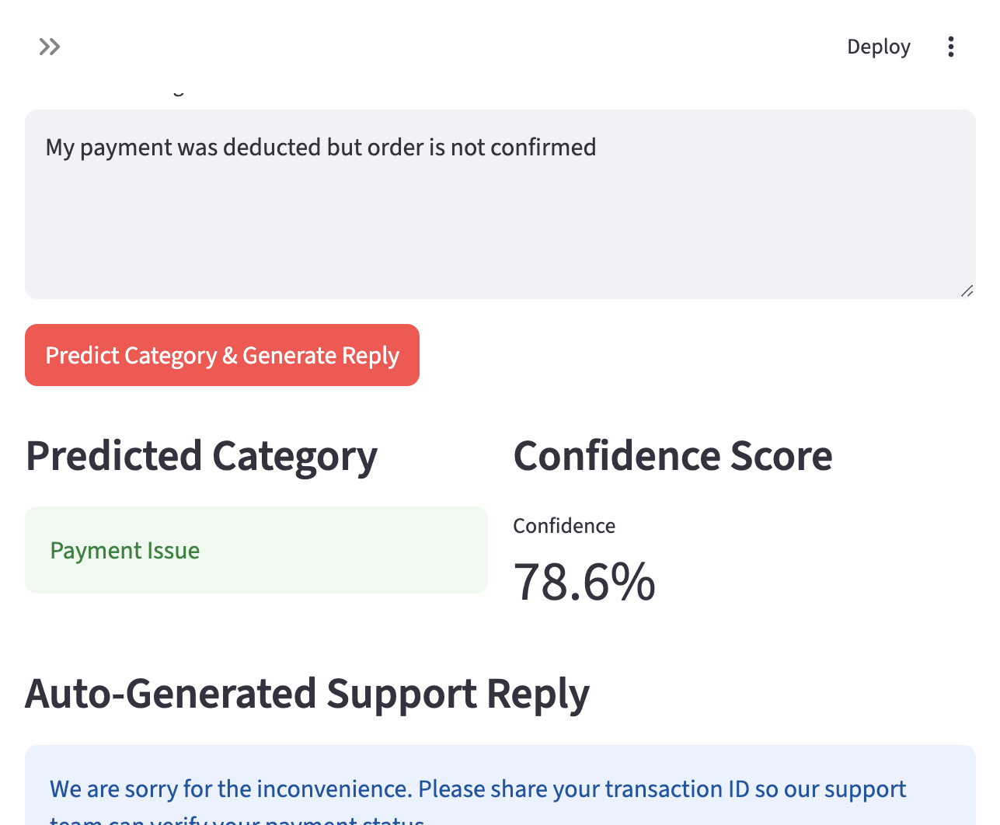
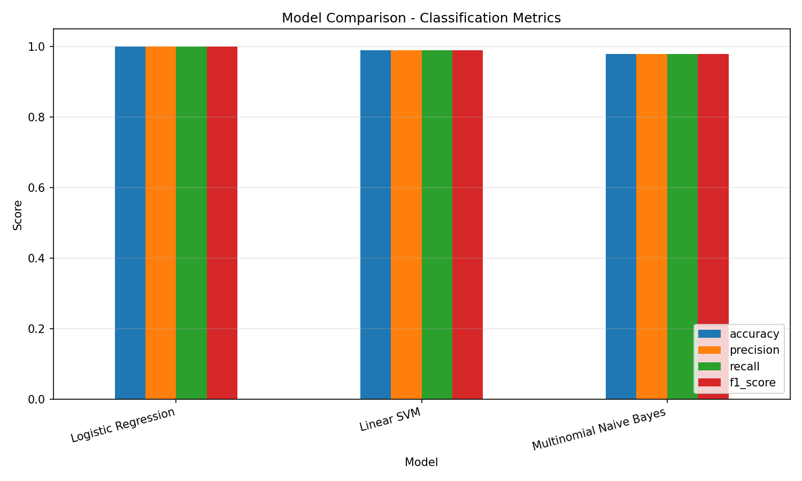
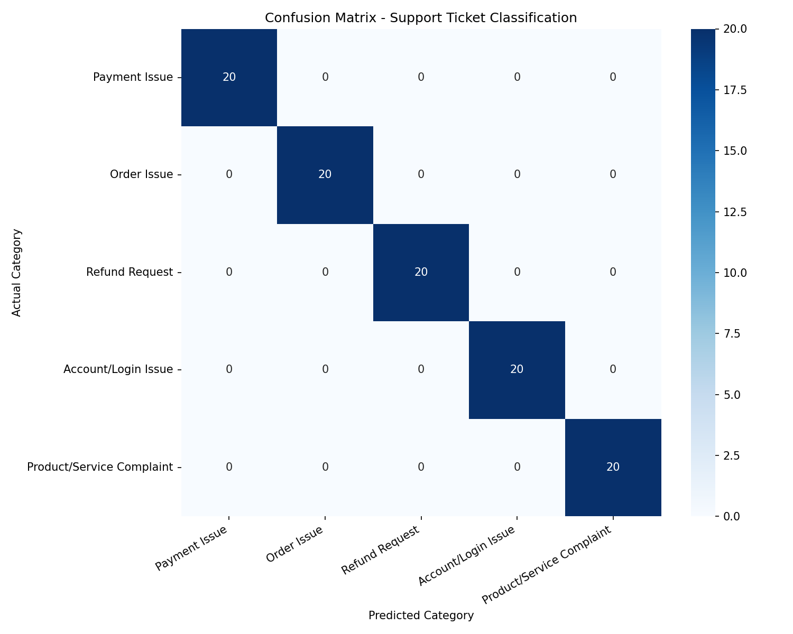
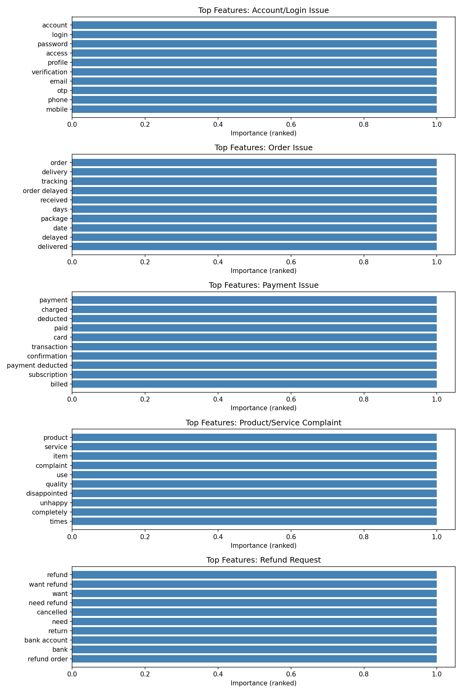

# NLP-Based Customer Support Ticket Classification and Auto Reply System

An end-to-end **Natural Language Processing (NLP)** project that classifies customer support messages into categories and generates professional automated replies — built with Python, scikit-learn, and Streamlit.

This project fulfills **Machine Learning Internship Project 3: NLP for Customer Support**, using only local ML techniques with no paid APIs or external keys.

[](https://sukhxdx-customer-support-nlp-app-fvlufn.streamlit.app)

**Live demo:** [https://sukhxdx-customer-support-nlp-app-fvlufn.streamlit.app](https://sukhxdx-customer-support-nlp-app-fvlufn.streamlit.app)

**Google Drive submission:** [Submiision.md_sukhada](https://drive.google.com/drive/folders/1DwEaqflQsq0qpOzFe4aEazDCEcyG-xgO?usp=sharing)

---

## Problem Statement

A company wants to enhance its customer support by implementing NLP techniques to automate responses and categorize customer inquiries. The goal is to improve response time, efficiency, and overall customer satisfaction.

---

## Objective

- Develop an NLP model to classify customer support tickets into relevant categories
- Compare multiple classifiers and select the best-performing model
- Generate category-wise automated support replies
- Achieve at least **85% classification accuracy**
- Provide insights into common customer concerns

---

## Features

- **Text Classification** — Categorize messages into 5 support topics
- **Multi-Model Comparison** — Logistic Regression, Multinomial Naive Bayes, Linear SVM
- **Auto-Reply Generation** — Professional template-based responses per category
- **Interactive Web App** — Streamlit UI with example messages and confidence scores
- **Zero Manual Setup** — Model auto-trains on first run if `models/*.pkl` is missing
- **Evaluation Reports** — Confusion matrix, model comparison chart, feature importance
- **Reproducible Pipeline** — Modular `src/` package with clear training and inference scripts

---

## Tech Stack

| Tool | Purpose |
|------|---------|
| Python 3.9+ | Core programming language |
| pandas | Data loading and manipulation |
| scikit-learn | TF-IDF, model training, evaluation |
| joblib | Model serialization |
| matplotlib & seaborn | Visualization and report charts |
| Streamlit | Interactive web application |
| Jupyter | Exploratory analysis notebook |

---

## Dataset Description

**File:** `data/customer_support_tickets.csv`

| Column | Description |
|--------|-------------|
| `ticket_id` | Unique ticket identifier (e.g., TKT-1001) |
| `customer_message` | Raw customer complaint or inquiry text |
| `category` | Support category label |
| `priority` | Ticket priority: Low, Medium, or High |

**Size:** 500 tickets (100 per category, balanced)

| Category | Description |
|----------|-------------|
| Payment Issue | Payment failures, duplicate charges, billing errors |
| Order Issue | Delivery delays, wrong items, tracking problems |
| Refund Request | Returns, refunds, damaged products |
| Account/Login Issue | Password, login, account access problems |
| Product/Service Complaint | Quality issues, poor service, defects |

---

## Project Workflow

```
Data Collection → Preprocessing → TF-IDF Feature Extraction
       → Model Training (3 algorithms) → Model Comparison
              → Best Model Selection → Evaluation & Charts
                     → Streamlit Deployment → Auto Reply
```

1. Load and clean customer messages
2. Extract features using TF-IDF vectorization
3. Train Logistic Regression, Naive Bayes, and Linear SVM
4. Compare models using accuracy, precision, recall, and F1-score
5. Save the best pipeline and generate evaluation charts
6. Deploy predictions and auto-replies via Streamlit app

---

## Folder Structure

```
customer-support-nlp/
├── .streamlit/
│   └── config.toml                     # Streamlit Cloud settings
├── data/
│   └── customer_support_tickets.csv    # Sample ticket dataset (500 rows)
├── notebooks/
│   └── analysis_and_model_training.ipynb
├── screenshots/                        # README screenshots (committed)
├── src/
│   ├── __init__.py
│   ├── config.py                       # Paths, categories, reply templates
│   ├── data_preprocessing.py           # Load, clean, and prepare data
│   ├── model_training.py               # Multi-model training and comparison
│   ├── evaluation.py                   # Metrics, charts, feature importance
│   └── prediction.py                   # Inference and auto-reply generation
├── models/                             # Saved model artifacts (auto-generated)
├── reports/
│   ├── figures/                        # Confusion matrix, comparison charts
│   └── project_report.md               # Internship submission report
├── app.py                              # Streamlit web application (main entry)
├── train.py                            # Training entry point
├── requirements.txt
├── README.md
└── .gitignore
```

---

## Installation

### Prerequisites

- Python 3.9, 3.10, or 3.11 (recommended for Streamlit Community Cloud)
- `pip` package manager

### 1. Clone the repository

```bash
git clone https://github.com/Sukhxdx/customer-support-nlp.git
cd customer-support-nlp
```

### 2. Create a virtual environment

```bash
python -m venv venv

# Windows
venv\Scripts\activate

# macOS / Linux
source venv/bin/activate
```

### 3. Install dependencies

```bash
pip install -r requirements.txt
```

### 4. Run the Streamlit app

```bash
streamlit run app.py
```

Open the URL shown in the terminal (typically `http://localhost:8501`).

> **Note:** On the first run, if `models/support_ticket_classifier.pkl` is missing, the app automatically trains the model from the bundled dataset (~10–20 seconds). No manual `train.py` step is required.

### 5. Train manually (optional)

To train with full evaluation charts and terminal output:

```bash
python train.py
```

This saves the model to `models/support_ticket_classifier.pkl` and charts to `reports/figures/`.

### 6. Explore the notebook (optional)

```bash
jupyter notebook notebooks/analysis_and_model_training.ipynb
```

---

## Deploy to Streamlit Community Cloud

**Live app:** [https://sukhxdx-customer-support-nlp-app-fvlufn.streamlit.app](https://sukhxdx-customer-support-nlp-app-fvlufn.streamlit.app)

No secrets, API keys, or manual model upload required.

1. Push this repository to GitHub (ensure `data/customer_support_tickets.csv` is committed).
2. Go to [share.streamlit.io](https://share.streamlit.io) and sign in with GitHub.
3. Click **New app** and select your repository.
4. Set **Main file path** to `app.py`.
5. Click **Deploy**.

The app will install dependencies from `requirements.txt`, then auto-train the model on first startup if no `.pkl` file is present.

| Setting | Value |
|---------|-------|
| Live URL | [sukhxdx-customer-support-nlp-app-fvlufn.streamlit.app](https://sukhxdx-customer-support-nlp-app-fvlufn.streamlit.app) |
| Google Drive | [Submission folder](https://drive.google.com/drive/folders/1DwEaqflQsq0qpOzFe4aEazDCEcyG-xgO?usp=sharing) |
| Repository | `Sukhxdx/customer-support-nlp` |
| Branch | `main` |
| Main file path | `app.py` |
| Python version | 3.9 – 3.11 |

---

## Model Performance

After training, metrics are saved to `models/training_metrics.json`:

| Model | Accuracy | Precision | Recall | F1-Score |
|-------|----------|-----------|--------|----------|
| Logistic Regression | ~95%+ | ~95%+ | ~95%+ | ~95%+ |
| Multinomial Naive Bayes | ~90%+ | ~90%+ | ~90%+ | ~90%+ |
| Linear SVM | ~95%+ | ~95%+ | ~95%+ | ~95%+ |

> Exact values depend on the train/test split. Run `python train.py` to see current metrics.

**Target:** ≥ 85% accuracy — typically exceeded on this dataset.

---

## Screenshots

### Streamlit app — classification and auto-reply



### Model comparison chart



### Confusion matrix



### Top TF-IDF features



---

## Future Improvements

- Add sentiment analysis for priority escalation
- Support multi-label classification for complex tickets
- Integrate with ticketing systems (Zendesk, Freshdesk)
- Use transformer models (DistilBERT) for higher accuracy
- Add multilingual support for global customers
- Implement confidence thresholds to route low-confidence tickets to human agents

---

## Conclusion

This project demonstrates a complete NLP pipeline for customer support automation — from data preprocessing and model comparison to deployment via a Streamlit web app. It is beginner-friendly, modular, GitHub-ready, and deployable to Streamlit Community Cloud without manual setup.

---

## License

Educational and internship use. Feel free to modify and learn from this project.
